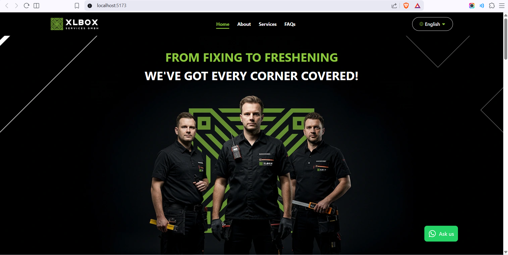
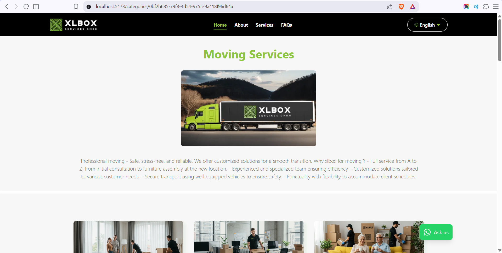
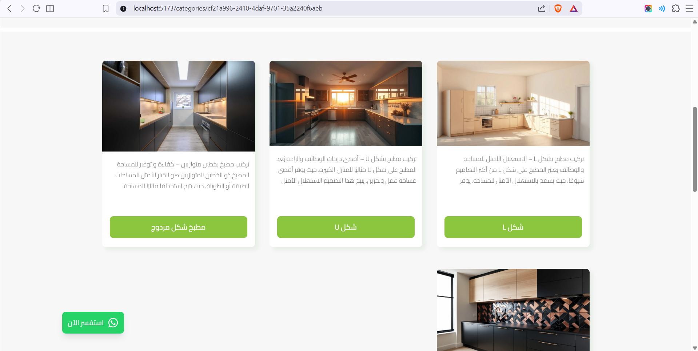
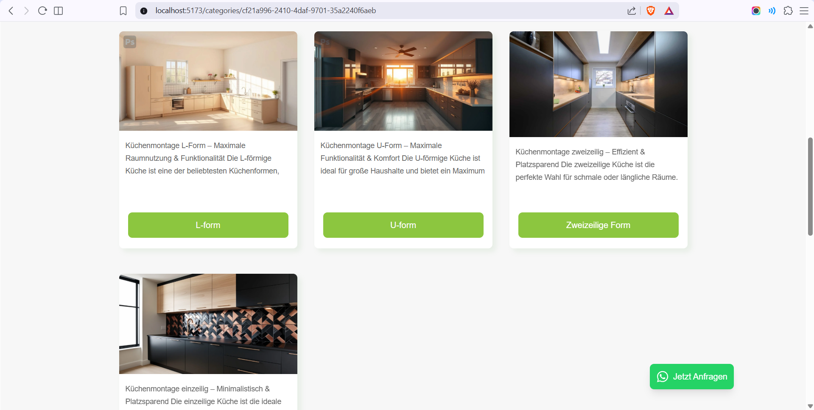
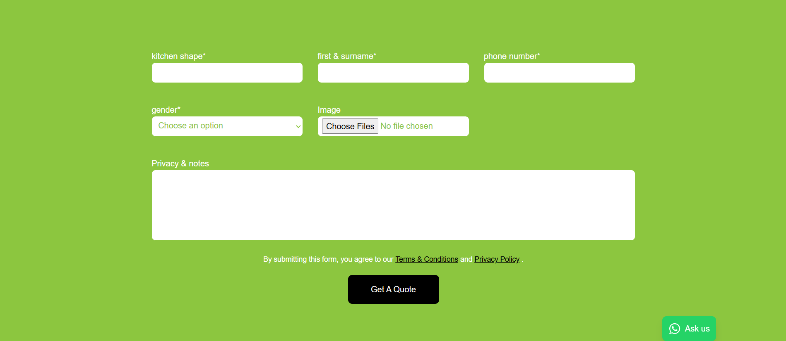

# 🚀 XLBox Services React App

A **React-based multi-service platform** designed to showcase and manage a large collection of services through a structured, interactive, and user-friendly interface.

The application focuses on presenting services in a clear way while maintaining a smooth navigation experience, dynamic content handling, and an extensible architecture for scaling service-based systems.

---

## 🧠 Project Overview

This project is built around a **service-driven architecture**, where each feature is treated as an independent service entry with its own configuration and behavior.

Key ideas behind the system:

* Organizing **23+ services** in a unified interface
* Providing a smooth browsing experience across services
* Supporting dynamic service configurations
* Building a scalable structure for future expansion
* Enhancing usability with modern UI interactions and animations

---

## ✨ Core Features

### 🌍 Multi-Lingual Platform

* Supports multiple languages for a broader user reach
* Dynamic language switching across the application
* Structured content handling for scalability across regions

---

### ⚙️ Service-Based Architecture (23+ Services)

* Platform structured around more than 23 distinct services
* Each service has its own flow, content, and configuration
* Scalable design allowing easy addition of new services

---

### 🎬 Interactive Animations & UX

* Engaging animations to enhance user interaction
* Smooth transitions between pages and sections
* Improves user retention and overall experience
* Built using modern React rendering for fluid UI updates

---

### ✨ Seamless Navigation Experience

* Intuitive navigation across multiple services
* Optimized routing for fast page transitions
* SPA behavior ensures no full page reloads

---

### 🛠️ Dynamic Admin Dashboard

* Admin panel for managing services and configurations
* Dynamic form builder with customizable fields per service
* Enables flexible content management without code changes

---

### 📑 Dynamic Forms System

* Custom forms generated per service
* Flexible field types and configurations
* Designed for scalability and reusability

---

### ✔️ Modular Frontend Architecture

* Built with reusable React components
* Clean and maintainable code structure
* Easy to scale and extend with new features
* Component-based architecture improves maintainability

---

### ⚡ Performance & Optimization

* Fast rendering using React’s efficient update system
* Reduced unnecessary re-renders
* Smooth user experience even with complex UI interactions

---

### 📱 Responsive Design

* Fully responsive across devices
* Optimized layouts for mobile, tablet, and desktop
* Consistent experience across screen sizes

---

### 🎯 User-Centric Design

* Focused on simplicity despite complex service structure
* Designed for easy interaction across multiple service flows
* Balances functionality with usability

---
## 🛠️ Tech Stack

### Frontend

* React.js
* Tailwind CSS
* Framer Motion

### Architecture

* Component-based architecture
* Service-oriented folder structure
* Modular and reusable UI components
* Config-driven service rendering approach

---

## ⚡ Key Highlights

* Structured handling of **23+ services in a single platform**
* Dynamic rendering of service pages based on configuration
* Smooth navigation between service modules
* Lightweight and responsive UI behavior
* Scalable architecture for adding new services without redesign

---

## 📁 Project Structure (Simplified)

```
src/
 ├── components/
 ├── hooks/
 ├── locale/
 └── pages/
```

## 🖼️ Screenshots

### Home Page


### Services Page


### Localization



### Dynamic Forms


---

## 🎯 Core Concepts

* Service-based UI architecture instead of static pages
* Separation between service data and UI rendering
* Reusable components to reduce duplication
* Centralized configuration for service management

---

## 🔮 Future Improvements

* Enhanced admin system for managing services dynamically
* Improved animations and transitions between services
* Advanced filtering and search across services
* Better state management for large-scale scalability

---

## 👨‍💻 Author

**Abdelrhman Elnhas**
Frontend Engineer | UI/UX Designer

Portfolio: https://abdelrhman-elnhas.com/

---

## ⭐ Final Note

This project is focused on building a **scalable service-based frontend system**, optimized for usability, structure, and future expansion rather than a traditional CRUD application.
